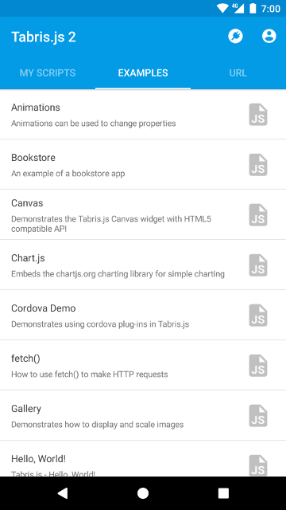

Getting Started
===============
Installing the Tabris.js developer clients...

Expore
======
The developer clients come pre-configured with serveral example apps. These examples demonstrate the power and flexibility of Tabris.js. 

Start the developer client and select the **examples** tab. 

The examples are freely available on GitHub and are developed entirely in JavaScript. Checkout the [GitHub repository](https://github.com/eclipsesource/tabris-js/tree/master/examples), or [download the examples as a single zip](http://tabrisjs.com/examples.zip).

See the on-line documentation for an overview of the [example apps](http://tabrisjs.com/examples).

Shared Apps
------------
How do you share apps!

Create Your First App
=====================
[Download and extend the examples](http://tabrisjs.com/examples.zip) to begin developing your first Tabris.js application.

    http://tabrisjs.com/examples.zip

Hello, World!
-------------
The first example you should look at is *Hello, World!*. You can run this directly from the Examples tab in the Tabris.js client, or extend it and host it locally. This example demonstrates how to create a minimal Tabris.js app.

    [$] cd examples/hello

### index.json
The index.json file is used to describe the app, incuding the name, description and a list of source files. All Tabris.js apps must include an index.json.

    {
     "title": "Hello, World!",
     "description": "Tabris.js - Hello, World!",
     "resources": [
      {
        "src": "http://download.eclipsesource.com/technology/tabris/js/current/tabris.min.js"
      },
      {
        "src": "hello.js"
      }
     ]
    }

### hello.js
The Tabris.js Hello, World! progam is contained in `examples/hello/hello.js`. Tabris.js apps can be developed using any text editor or IDE. 

	tabris.load(function() {
	
  	 var page = tabris.create("Page", {
   	   title: "Hello, World!",
   	   topLevel: true
  	  });

  	  var button = tabris.create("Button", {
        text: "Native Widgets",
        layoutData: { centerX: 0, top: 100 }
  	  }).on("selection", function() {
        label.set("text", "Totally Rock!");
  	  }).appendTo(page);

  	  var label = tabris.create("Label", {
        font: "24px",
        layoutData: {centerX: 0, top: [button, 50]}
  	  }).appendTo(page);

  	  page.open();

	});
	
The Hello, World! app contains a *button* and a *label*. When the button is selected, the label is updated. Both the button and the label are placed on the *page* relative to one another.

### Deploying your App
The Tabris.js clients load the apps over-the-air and execute them on the device using a JavaScript runtime and native widget bindings. The easiest way to deploy a Tabris.js app is to host it on a web server and point the native client to that URL. 

Node.js provides an easy to configure HTTP server. Download and instal [node.js](http://nodejs.org/), and using the node package manager, install `http-server`. From your hello world directory, run:

    [$] npm install http-server     
    [$] http-server ./ -p 7777

*You can also place your `index.json` and `hello.js` files on any http-server, as long as it's accessible from your device.*

Once deployed, use the Tabris.js client to access the app. This can be configured under the URL tab on the client. In the case of a node-js http-server running on your development device, enter:

    http://<device-ip-address>:7777/
    
Tabris Connect, the web-portal for Tabris.js, can also be used to configure the URLs available on your device.     

### The Developer Console
The Tabris.js clients ship with a developer console that can be used to track errors and warnings in the running apps. The console can be slid from the right side of the client. The console provides functionality to filter messages and restart the app. Messages can be logged to the console using the global console object:

    console.log("A log message");
    console.error("An error Message");
    console.warn("A warning message");
    console.info("An info message");
    console.debug("A debug Message");

Share
=====

Further Information
===================
[http://tabrisjs.com](http://tabrisjs.com) is your key to Tabris.js. The portal is filled with documentation, examples, the Tabris.js development roadmap, and tools for connecting with your device. The portal also contains links to the examples and snippets. 

Feedback
========
Help us improve Tabris.js! Feedback is always welcome, 

